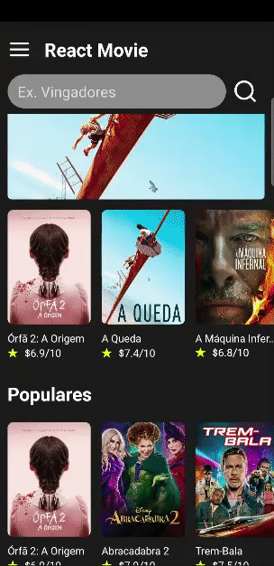

# Appmovie

É um pequeno projeto de filmes em cartaz usando uma api externa de filmes.

   

# Tecnologias usadas: #

-React native 
-Javascript 
-Styled-components

# Instalação

Para instalá-las abra o terminal do seu computador, navegue até a pasta raiz do projeto e digite:

npm install

Após a instalação das dependências, basta executar o seguinte comando:

npm start

